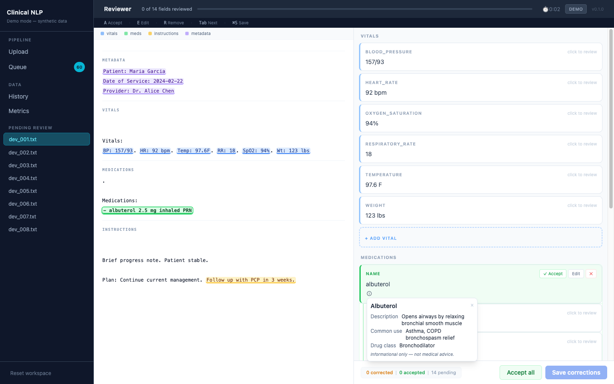

# Clinical Notes NLP Assistant

A full-stack web app that extracts structured data from clinical notes, presents it in a keyboard-driven reviewer UI, and tracks live correction rates and review activity.

> **Live demo:** [clinical-nlp.vercel.app](https://clinical-nlp.vercel.app/)

> **All data is entirely synthetic.** No real patient information is used anywhere in this project. Handwritten notes are not supported.

---

## Screenshots

**Upload**


**Queue**


**Review**


**Contextual explainer**



**History**


**Metrics**


---

## What it does

A clinical note comes in as pasted text, a `.txt` file, a text-based PDF, a scanned printed document, or an image-based typed document. The pipeline breaks it into sections and extracts:

- **Vitals** — BP, HR, temperature, RR, SpO2, weight, with units preserved
- **Medications** — name, dose, route, frequency, duration, PRN qualifier
- **Instructions** — discharge instructions, follow-up plan, return precautions
- **Metadata** — patient name, date of service, provider

The extracted fields are presented in a reviewer UI where each one can be accepted, edited, or removed. Corrections persist to the hosted database and surface as live product metrics — correction rates by category and field, review counts, and average review time.

Each browser session gets its own **isolated workspace** — no login required. The workspace resets cleanly via the "Reset workspace" button in the sidebar.

---

## Contextual explainer

The review UI includes a built-in **contextual explainer** that helps reviewers understand unfamiliar terms without leaving the page. Clicking the info icon on any medication or abbreviation field opens an explanation inline.

**How it works:**

- **Dictionary-first:** common medications (~20) and clinical abbreviations (frequencies, routes, qualifiers) resolve instantly from a local dictionary — no network call, no latency.
- **AI on demand:** for terms not in the dictionary, reviewers can optionally request a field-level AI explanation from the backend. The result is structured and informational only.
- **Scoped and constrained:** AI explanations cover what the term is, its common clinical use, and a plain-language summary. They do not provide diagnosis, dosing advice, or treatment recommendations. Every AI response carries a disclaimer: *"AI-generated explanation for informational review only — not medical advice."*
- **Graceful degradation:** if no API key is configured, AI controls hide and the dictionary path continues to work.

---

## Demo flow

1. Open the [live app](https://clinical-nlp.vercel.app/) and click **Seed demo data** to load synthetic notes into your session
2. Open the Queue — notes pending review are listed there
3. Click a note to open it in the Review page
4. Accept, edit, or remove extracted fields using keyboard shortcuts or mouse
5. Click the info icon (ⓘ) on any medication or abbreviation to open the contextual explainer
6. Save — the UI auto-advances to the next pending note
7. Check the Metrics page to see live correction rates and review activity

Your workspace is isolated to your browser session. Click **Reset workspace** to start fresh.

---

## Deployment

| Layer | Service |
|-------|---------|
| Frontend | [Vercel](https://vercel.com) — Vite/React, deployed from `frontend/` |
| Backend | [Render](https://render.com) — Flask + gunicorn |
| Database | [Supabase](https://supabase.com) — managed Postgres |

---

## Tech stack

| Layer | Technologies |
|-------|-------------|
| Backend | Flask, SQLAlchemy, Postgres (prod) / SQLite (local) |
| Frontend | React, TypeScript, Vite, Tailwind CSS |
| NLP | medSpaCy, spaCy, regex, Tesseract OCR |
| AI explainer | Anthropic Claude Haiku (field-level, on-demand only) |

---

## Architecture

```
[Input]
  paste text / .txt / .pdf (text layer) / .pdf (OCR) / image (.png, .jpg, .tiff)
        │
        ▼
[Flask API — Render (prod) / localhost:5000 (dev)]
        │
        ├── NLP Pipeline (rule-based, no external calls)
        │     section detection → vitals → medications → instructions → metadata
        │
        └── /api/explain (on-demand, requires ANTHROPIC_API_KEY)
              field-level term explanation via Claude Haiku
        │
        ▼
[Postgres via SQLAlchemy (prod) / SQLite (dev)]
  notes → extractions → validations
        ▲
        │
[React UI — Vercel (prod) / localhost:5173 (dev)]
  Upload → Queue → Review → History → Metrics
```

The extraction pipeline is entirely rule-based and deterministic — section detection uses medSpaCy's Sectionizer plus header regex, vitals use unit-preserving regex, and the medication extractor combines structured line parsing, prose extraction from Plan/A&P sections, and a medSpaCy TargetMatcher with ConText for negation. The AI explainer is a separate, optional path triggered only by reviewer interaction on a single field.

---

## Local setup

Requires Python 3.11, Node 18+, and Tesseract (for OCR on images/scanned PDFs).

```bash
# macOS
brew install tesseract poppler

# Ubuntu / Debian
sudo apt-get install -y tesseract-ocr poppler-utils
```

```bash
git clone https://github.com/KanujVerma/clinical-notes-nlp-assistant
cd clinical-notes-nlp-assistant

# Python environment
python3.11 -m venv .venv
source .venv/bin/activate
pip install -r requirements.txt

# Frontend
cd frontend
npm install
cd ..
```

**Environment variables (optional):**

The app runs fully without any API keys. To enable the AI explainer locally, set:

```bash
export ANTHROPIC_API_KEY=sk-ant-...
```

---

## Running locally

**Terminal 1 — backend:**
```bash
source .venv/bin/activate
cd backend
python app.py
# Flask on http://localhost:5000
```

**Terminal 2 — frontend:**
```bash
cd frontend
npm run dev
# Vite on http://localhost:5173
```

Open `http://localhost:5173`. Click **Seed demo data** in the UI to load the synthetic notes. Local dev uses SQLite — no database setup required.

---

## Docker

```bash
docker compose up
# App at http://localhost:5000
```

---

## Review workflow

The reviewer UI is keyboard-driven. Select or focus a field card, then:

| Key | Action |
|-----|--------|
| `A` | Accept |
| `E` | Edit |
| `R` | Remove |
| `Tab` / `Shift+Tab` | Cycle through fields |
| `Esc` | Deactivate |
| `⌘S` / `Ctrl+S` | Save |

A progress bar in the top bar tracks how many fields have been reviewed. After saving, the app auto-advances to the next pending note. Navigating away with unsaved changes triggers a confirmation prompt.

Medication cards group dose, route, frequency, and duration under the drug name with a visual indent. Medications captured from prose with no sig information get a **mention only** label — the reviewer decides whether to keep or remove them.

Re-opening a previously reviewed note reconstructs the prior field statuses from the diff of extracted vs. validated data, shows a banner, and carries the review timer forward.

---

## Metrics

The Metrics page shows **live signals computed from reviewer activity in the current session**:

- Correction rate by category (vitals, medications, instructions, metadata)
- Correction rate by field (top 10 most-corrected fields)
- Review counts and average review time by status

These update as notes are reviewed and saved.

### Offline evaluation benchmark (development only)

A separate offline script measures parser F1 against a hand-labeled synthetic evaluation set of 20 notes (`data/eval/labels/`). This is a development tool and is not surfaced in the deployed app.

```bash
source .venv/bin/activate
python scripts/run_evaluation.py
```

Sample output:
```
============================================================
  Clinical NLP Evaluation — pipeline v0.1.0
============================================================
  Category              Precision     Recall         F1
  vitals                    0.892      0.627      0.736
  medications               0.488      0.467      0.477
  instructions              0.821      0.469      0.597
  metadata                  0.775      0.633      0.697
  OVERALL                   0.768      0.571      0.655
============================================================
  Notes evaluated: 20
```

---

## Limitations

- **Medication extraction is a prototype.** Structured medication lines with dose/sig usually parse correctly. Prose-only mentions depend more on the curated vocabulary and sentence-level action patterns. No RxNorm, no brand/generic normalization, no dose unit conversion.
- **Handwritten notes are not supported.** OCR works for clean printed and typed scans. Handwriting degrades Tesseract significantly and is out of scope.
- **OCR quality depends on scan quality.** Poor contrast, unusual fonts, or heavy artifacts may produce text the extractor can't recover from.
- **The AI explainer is scoped and informational only.** It explains what a term is — it does not diagnose, recommend treatment, or advise on dosing. It is not a medical chatbot.
- **Dictionary coverage is partial.** Common medications and standard abbreviations are covered. Less common terms fall back to AI on demand, which may produce generic results for ambiguous inputs.
- **AI explanations are not persisted.** Each AI call is ephemeral and scoped to the field shown. Rate-limited to 20 requests per session per hour.
- **No authentication.** The live demo is open — do not upload real patient data.
- **No real PHI.** All demo data is synthetic. Do not use with real patient information.

---

## Potential next steps

- RxNorm integration for drug normalization and broader vocabulary coverage
- scispaCy (`en_core_sci_sm`) for better clinical tokenization
- FHIR-structured output
- Active learning: surface low-confidence extractions and use reviewer corrections to extend the rules over time
- Broader dictionary coverage to reduce AI fallback surface area

---

## Development

**Backend tests** (277 unit + integration tests, includes a four-note regression pack):
```bash
source .venv/bin/activate
pytest backend/tests/ -v
```

**Frontend unit tests:**
```bash
cd frontend
npm test
```

**End-to-end smoke tests** (Playwright, requires both servers running):
```bash
cd frontend
npx playwright test
```

---

## Synthetic data disclaimer

All clinical notes in this project (`data/dev/`, `data/eval/`, `data/showcase/`) are entirely synthetic, generated programmatically or hand-authored for demonstration purposes. They contain no real patient information, no real provider names, and no real medical records. Any resemblance to real individuals is coincidental.
