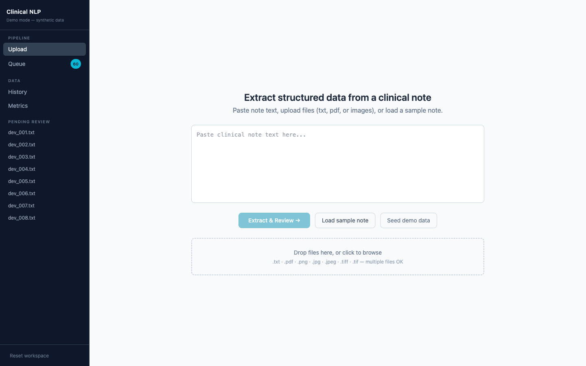
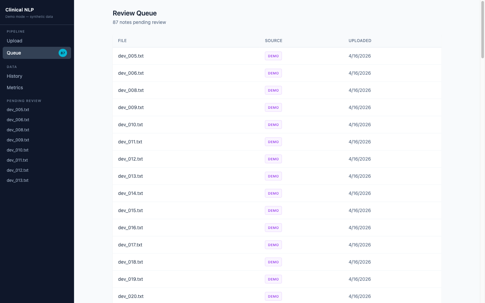
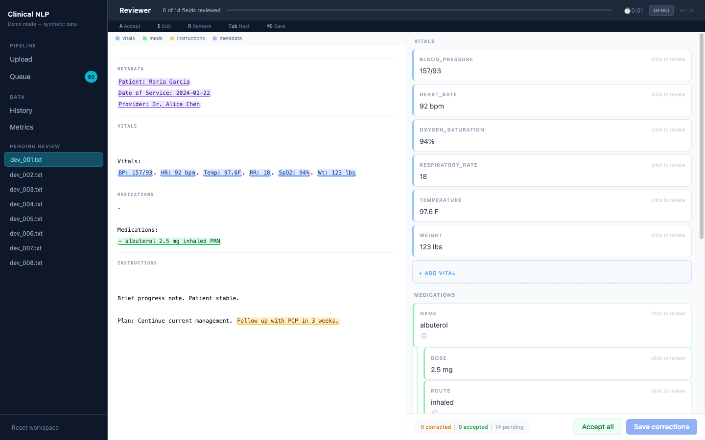
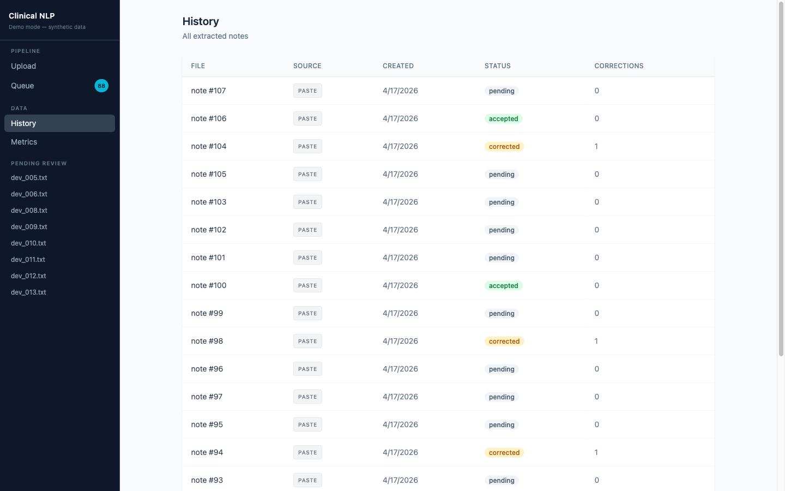
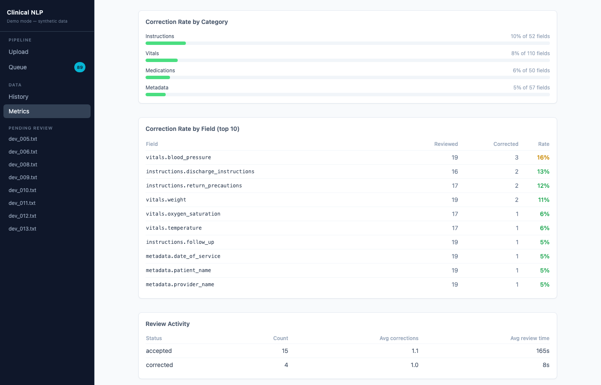

# Clinical Notes NLP Assistant

A full-stack web app that extracts structured data from clinical notes, presents it in a keyboard-driven reviewer UI, and tracks live correction rates and review activity.

> **Live demo:** [clinical-nlp.vercel.app](https://clinical-nlp.vercel.app/)

> **All data is entirely synthetic.** No real patient information is used anywhere in this project. Handwritten notes are not supported in v1.

---

## Screenshots

**Upload**



**Queue**



**Review**



**History**



**Metrics**



---

## What it does

A clinical note comes in as pasted text, a `.txt` file, a text-based PDF, a scanned printed document, or an image-based typed document. The pipeline breaks it into sections and extracts:

- **Vitals** — BP, HR, temperature, RR, SpO2, weight, with units preserved
- **Medications** — name, dose, route, frequency, duration, PRN qualifier
- **Instructions** — discharge instructions, follow-up plan, return precautions
- **Metadata** — patient name, date of service, provider

The extracted fields are presented in a reviewer UI where each one can be accepted, edited, or removed. Corrections persist to the hosted database and surface as live product metrics — correction rates by category and field, review counts, and avg review time.

---

## Demo flow

1. Open the [live app](https://clinical-nlp.vercel.app/) and click **Seed demo data** to load synthetic notes
2. Open the Queue — pending notes waiting for review are listed there
3. Click a note to open it in the Review page
4. Accept, edit, or remove fields using the keyboard or mouse
5. Save — the UI auto-advances to the next pending note
6. Check the Metrics page to see live correction rates and review activity

All uploaded notes, validations, history, and metrics persist in the hosted Supabase database.

---

## Deployment

| Layer | Service |
|-------|---------|
| Frontend | [Vercel](https://vercel.com) — Vite/React, deployed from `frontend/` |
| Backend | [Render](https://render.com) — Flask + gunicorn, free web service |
| Database | [Supabase](https://supabase.com) — managed Postgres, tables auto-created on first start |

---

## Tech stack

| Layer | Technologies |
|-------|-------------|
| Backend | Flask, SQLAlchemy, Postgres (prod) / SQLite (local) |
| Frontend | React, TypeScript, Vite, Tailwind CSS |
| NLP | medSpaCy, spaCy, regex, Tesseract OCR |

---

## Architecture

```
[Input]
  paste text / .txt / .pdf (text layer) / .pdf (OCR) / image (.png, .jpg, .tiff)
        │
        ▼
[Flask API — Render (prod) / localhost:5000 (dev)]
        │
        ▼
[NLP Pipeline]
    section detection → vitals → medications → instructions → metadata
        │
        ▼
[Postgres via SQLAlchemy (prod) / SQLite (dev)]
  notes → extractions → validations
        ▲
        │
[React UI — Vercel (prod) / localhost:5173 (dev)]
  Upload → Queue → Review → History → Metrics
```

The pipeline is entirely rule-based — no LLM calls, no API keys, and deterministic output for the same input note. Section detection uses medSpaCy's Sectionizer plus header regex patterns. Vitals use unit-preserving regex. The medication extractor combines structured line parsing, prose extraction from Plan/A&P sections, and a medSpaCy TargetMatcher with ConText for negation handling. Instructions use a three-tier approach: dedicated sections first, then sub-classification of Plan/HPI text, then a keyword fallback.

---

## Local setup

Requires Python 3.11, Node 18+, and Tesseract (for OCR on images/scanned PDFs).

```bash
# macOS
brew install tesseract poppler

# Ubuntu / Debian
sudo apt-get install -y tesseract-ocr poppler-utils
```

```bash
git clone https://github.com/KanujVerma/clinical-notes-nlp-assistant
cd clinical-notes-nlp-assistant

# Python environment
python3.11 -m venv .venv
source .venv/bin/activate
pip install -r requirements.txt

# Frontend
cd frontend
npm install
cd ..
```

---

## Running locally

**Terminal 1 — backend:**
```bash
source .venv/bin/activate
cd backend
python app.py
# Flask on http://localhost:5000
```

**Terminal 2 — frontend:**
```bash
cd frontend
npm run dev
# Vite on http://localhost:5173
```

Open `http://localhost:5173`. Local dev uses SQLite — no database setup required.

**Seed demo data (optional):**
```bash
source .venv/bin/activate
python scripts/seed_demo_data.py
```

---

## Docker

```bash
docker compose up
# App at http://localhost:5000
```

---

## Review workflow

The reviewer UI is keyboard-driven. Select or focus a field card, then use the following shortcuts:

| Key | Action |
|-----|--------|
| `A` | Accept |
| `E` | Edit |
| `R` | Remove |
| `Tab` / `Shift+Tab` | Cycle through fields |
| `Esc` | Deactivate |
| `⌘S` / `Ctrl+S` | Save |

A progress bar in the top bar tracks how many fields have been reviewed. After saving, the app auto-advances to the next pending note. Navigating away with unsaved changes triggers a confirmation prompt.

Medication cards group dose, route, frequency, and duration under the drug name with a visual indent so it is clear which sig belongs to which drug. Medications captured from prose with no sig information get a **mention only** label — the reviewer decides whether to keep or remove them.

Re-opening a previously reviewed note reconstructs the prior field statuses from the diff of extracted vs. validated data, shows a banner, and carries the review timer forward.

---

## Metrics

The deployed app's Metrics page shows **live product signals** computed from real reviewer activity:

- Correction rate by category (vitals, medications, instructions, metadata)
- Correction rate by field (top 10 most-corrected fields)
- Review counts and average review time by status

These update in real time as notes are reviewed and saved.

### Offline evaluation benchmark (development only)

A separate offline evaluation script measures parser F1 against a hand-labeled synthetic evaluation set of 20 notes (`data/eval/labels/`). This is a development benchmarking workflow and is not surfaced in the deployed app UI.

```bash
source .venv/bin/activate
python scripts/run_evaluation.py
```

Sample output:
```
============================================================
  Clinical NLP Evaluation — pipeline v0.1.0
============================================================
  Category              Precision     Recall         F1
  vitals                    0.892      0.627      0.736
  medications               0.488      0.467      0.477
  instructions              0.821      0.469      0.597
  metadata                  0.775      0.633      0.697
  OVERALL                   0.768      0.571      0.655
============================================================
  Notes evaluated: 20
```

---

## Limitations

- **Medication extraction is a prototype.** Structured medication lines with dose/sig usually parse correctly even for drugs outside the curated vocabulary. Prose-only medication mentions are more dependent on the curated vocabulary and sentence-level action patterns. No RxNorm, no brand/generic normalization, no dose unit conversion.
- **Handwritten notes are not supported.** OCR works for clean printed and typed scans. Handwriting degrades Tesseract output significantly and is out of scope for this version.
- **OCR quality depends on scan quality.** Poor contrast, unusual fonts, or heavy artifacts may produce garbled text the extractor can't recover from.
- **Coverage is bounded by the implemented rules.** Unusual phrasings, heavy abbreviations, or note formats outside the supported section/header patterns will reduce extraction quality.
- **No authentication.** The live demo is open — do not upload real patient data.
- **No real PHI.** All demo data is synthetic. Do not use with real patient information.

---

## Potential next steps

- RxNorm integration for drug normalization and broader vocabulary coverage
- scispaCy (`en_core_sci_sm`) for better clinical tokenization
- LLM fallback for fields the rule-based extractors miss consistently
- FHIR-structured output
- Active learning: surface low-confidence extractions and use reviewer corrections to extend the rules over time

---

## Development

**Backend tests** (118 unit + integration tests, includes a four-note regression pack):
```bash
source .venv/bin/activate
pytest backend/tests/ -v
```

**Optional end-to-end smoke tests** (Playwright, requires both servers running):
```bash
cd frontend
npx playwright test e2e/smoke.spec.ts
```

---

## Synthetic data disclaimer

All clinical notes in this project (`data/dev/`, `data/eval/`, `data/showcase/`) are entirely synthetic, generated programmatically or hand-authored for demonstration purposes. They contain no real patient information, no real provider names, and no real medical records. Any resemblance to real individuals is coincidental.
